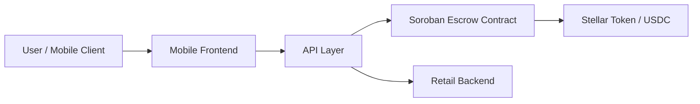

# Velo

[](LICENSE)

Velo is an open-source payment and liquidity platform for privacy-preserving cash access on Stellar. It combines Soroban smart contracts, a lightweight API layer, and a mobile-first experience to make cash-like settlement practical for real-world use cases such as agent-assisted payments, local commerce, and programmable escrow.

## Why Velo Exists

Modern digital payments are fast, but they are often brittle for real-world cash interactions. Velo exists to bridge the gap between on-chain settlement and offline or mediated cash flows by providing a transparent, auditable, and extensible framework for escrow, conditional settlement, and payment-backed access.

## Problem Statement

Many payment systems assume that both parties are already online, wallet-enabled, and comfortable interacting with a blockchain directly. That expectation breaks down in everyday commerce, agent-mediated workflows, and mobile-first environments where users need a simple path to receive value without compromising security or trust.

Velo addresses this gap with a system that:

- supports escrow-based conditional settlement,
- enables payment-backed API access through a simple x402-style flow,
- provides a mobile claim experience for users who interact via QR or shared links,
- keeps core settlement logic verifiable on-chain through Soroban contracts.

## Solution Overview

Velo combines three layers:

1. Soroban smart contracts for escrow and atomic-swap primitives.
2. A TypeScript API layer for orchestration, payment challenge handling, and service access.
3. A mobile frontend and backend for user-facing claim and retail workflows.

The platform is designed to be modular so that contributors can improve one part of the stack without threatening the stability of the rest.

## Architecture Overview

The system is organized around a simple trust model:

- buyers lock funds in escrow,
- sellers or claimants receive funds only when the correct condition is satisfied,
- the API layer exposes the flow to clients and agents,
- the mobile experience provides a lightweight path for users to complete or claim transactions.

For a detailed step-by-step visual sequence of the end-to-end payment and cash request flow, see the [End-to-End Request Flow Diagram](docs/request-flow.md).



## Key Features

- escrow-based conditional payment settlement,
- Soroban-powered smart contract primitives,
- x402-style payment gating for API access,
- QR-based claim flows for mobile users,
- shared contract address registry for consistent integration,
- modular architecture suitable for incremental production rollout.

## Technology Stack

- Rust for Soroban contracts
- TypeScript for API and shared packages
- Fastify for service APIs
- React + Vite for the mobile frontend
- TurboRepo for workspace orchestration
- Stellar / Soroban for settlement infrastructure

## Soroban Smart Contracts

The contracts in this repository currently focus on escrow and HTLC-style primitives that make conditional settlement possible. The escrow contract locks funds from a buyer until a release condition is satisfied or a refund condition is reached.

### Deployed Escrow Contract Addresses

The repository keeps escrow contract addresses in the shared registry under [packages/shared/src/index.ts](packages/shared/src/index.ts). The current documented testnet deployment is:

- Testnet escrow: `CAEYSVTKTCZYTSMPD7CU3NOFYOO4S5V6LJLGRNV7LKTNZ65N66PCHLMC`

The mainnet escrow address remains unset until a production deployment is finalized. This separation makes it clear which network a client or integrator should target when interacting with the escrow flow.

## Zero-Knowledge Infrastructure

Velo is also structured around privacy-preserving identity and credential concepts. While the current repository primarily exposes the core payment and escrow workflow, the architecture anticipates future integration with zero-knowledge credential verification and nullifier-based privacy primitives.

## API Overview

The API layer provides the integration surface for clients and agents. It exposes routes for:

- service discovery,
- cash request orchestration,
- payment challenge responses,
- reputation and provider discovery concepts.

## Mobile Application

The mobile experience is intentionally lightweight and QR-centric. It allows a user to claim or complete a payment flow without requiring a full wallet-native experience at the first step.

## Installation

### Prerequisites

- Node.js 20 or newer
- npm 10 or newer
- Rust toolchain
- wasm target: `wasm32v1-none`
- Soroban CLI or Stellar CLI
- A funded Stellar testnet account

### Bootstrap

```bash
git clone https://github.com/Nullifier-Systems/velo.git
cd velo
npm install
cp apps/api/.env.example apps/api/.env
cp mobile/backend/.env.example mobile/backend/.env
```

For the full ordered local setup walkthrough, including the Rust and Soroban prerequisites plus the Windows-specific gotchas, see [docs/development.md](docs/development.md).

## Local Development

Run the workspace using TurboRepo:

```bash
npm run dev
```

Run individual services:

```bash
npm run dev:api
npm run dev:backend
npm run dev:frontend
```

## Running Tests

```bash
npm run test
cd contracts && cargo test --workspace
```

## Repository Structure

```text
apps/
  api/                API gateway and payment-aware routes
mobile/
  frontend/           React/Vite consumer app
  backend/            retail and matching-service scaffold
contracts/
  escrow/             escrow contract
  atomic-swap/        atomic swap contract scaffold
  htlc-core/          shared HTLC abstractions
packages/
  shared/             shared constants, contract metadata, and types
docs/                contributor and architecture documentation
```

## Documentation Links

- [docs/request-flow.md](docs/request-flow.md) (End-to-End Request Flow Diagram)
- [docs/architecture.md](docs/architecture.md)
- [docs/smart-contracts.md](docs/smart-contracts.md)
- [docs/api.md](docs/api.md)
- [docs/development.md](docs/development.md)
- [docs/testing.md](docs/testing.md)

## Security

Security is a first-class concern. Please review [SECURITY.md](SECURITY.md) before reporting vulnerabilities. Do not open public issues for security-sensitive findings.

## Contributing

Contributions are welcome. Please read [CONTRIBUTING.md](CONTRIBUTING.md) before opening a pull request.

## Roadmap

The near-term roadmap focuses on hardening the escrow flow, improving contract coverage, documenting the payment integration path, and expanding the mobile claim experience.

## Frequently Asked Questions

### Is Velo production-ready?

Velo is an actively evolving platform. The core contracts and integrations are present, but contributors should expect some areas to remain in active development.

### Is the repository open source?

Yes. Velo is released under the [Apache License 2.0](LICENSE) and is intended for open collaboration and public review.

### Where should I start?

A good entry point is the escrow contract, the API routes, and the mobile claim experience.

## License

This project is licensed under the Apache License 2.0. See [LICENSE](LICENSE) for details.

## Acknowledgements

Velo builds on the work of the Stellar, Soroban, Fastify, React, and Rust ecosystems. It is maintained by Nullifier Systems and the wider contributor community.
