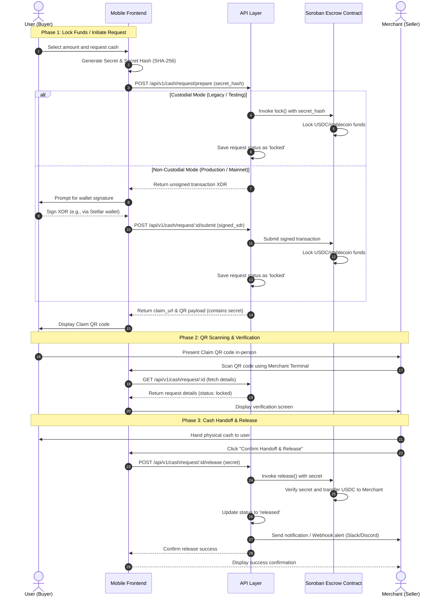

# End-to-End Request Flow

This document details the end-to-end request flow of Velo, showing how the **User (Buyer)**, **Mobile Frontend**, **API Layer**, **Soroban Escrow Contract**, and **Merchant (Seller/Cash Provider)** connect and interact.

The transaction flow is split into three main phases:
1. **Escrow Locking (Initiation)**: Securing stablecoin funds on-chain (supporting both Custodial and Non-Custodial modes).
2. **Verification (QR Scanning)**: Physical meeting between the buyer and the cash provider, scanning the claim QR code to fetch details.
3. **Escrow Release (Cash Handoff)**: Submitting the release secret to the contract to trigger on-chain settlement, followed by handing over physical cash.

---

## Request Flow Diagram

---

## Detailed Step-by-Step Flow

### Phase 1: Escrow Locking (Initiation)
1. **User (Buyer)** initiates a cash withdrawal request on the mobile app.
2. **Mobile Frontend** generates a cryptographic `secret` and its hash (`secret_hash = sha256(secret)`) locally on the client device. The secret is never sent to the API gateway during initiation to preserve trust boundaries.
3. **Mobile Frontend** submits the request to the **API Layer** (`POST /api/v1/cash/request/prepare`).
4. Based on the selected `mode`:
   - **Custodial Mode**: The API gateway signs the lock transaction using a backend-held account, invoking the `lock` function on the **Soroban Escrow Contract** directly.
   - **Non-Custodial Mode**: The API gateway constructs an unsigned transaction XDR and returns it to the client. The User signs this transaction with their non-custodial Stellar wallet (e.g. Freighter) and submits the signed envelope to the API gateway (`POST /api/v1/cash/request/:id/submit`), which broadcasts it to the Stellar network.
5. Once confirmed, the **Soroban Escrow Contract** locks the USDC funds under the specified contract registry state.
6. The **API Layer** returns a `claim_url` and a `qr_payload` containing the `request_id` and the raw client-generated `secret`.
7. The **Mobile Frontend** renders this payload as a secure QR code for the user.

### Phase 2: QR Scanning & Verification
8. The **User** meets the **Merchant** in person and displays the Claim QR code.
9. The **Merchant** opens the **Merchant Release Terminal** on their frontend and scans the QR code.
10. The scanning terminal extracts the `request_id` and `secret` from the QR payload.
11. The merchant's frontend fetches transaction details from the **API Layer** (`GET /api/v1/cash/request/:id`) to display the locked amount, buyer address, and current status.
12. The **API Layer** verifies the database record and returns the metadata.
13. The merchant terminal displays the verification screen.

### Phase 3: Cash Handoff & Release
14. The **Merchant** hands the corresponding physical cash to the **User**.
15. Upon successful physical handoff, the merchant confirms the action on the terminal.
16. The merchant terminal calls the **API Layer** (`POST /api/v1/cash/request/:id/release`) containing the scanned `secret`.
17. The **API Layer** submits the release transaction to the **Soroban Escrow Contract**, passing the `secret`.
18. The **Soroban Escrow Contract** checks if `sha256(secret)` matches the stored `secret_hash`. If correct, the contract transfers the locked USDC funds to the merchant's Stellar account.
19. The **API Layer** marks the cash request status as `released` and sends real-time updates (via WebSockets/SSE) and optionally webhook alerts (Slack/Discord) and SMS/Email notifications to the user.
20. The **API Layer** returns a success status to the merchant terminal.
21. The merchant terminal shows a final transaction completion screen.
